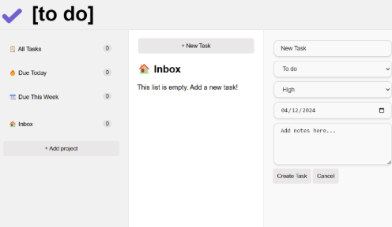

# ☑️ [to do] App

A modular, dynamic task management app.

Built with **JavaScript/TypeScript**, leveraging **Webpack** for bundling, and deployed using **gh-pages**.



🔗 Live demo: https://estellel-github.github.io/todo-app-webpack/

---

## Features

- Organize tasks under separate projects with intuitive editing and deletion.
- Filter tasks by due date:
  - All Tasks
  - Due Today
  - Due This Week
- Use the dedicated task pane to add or edit tasks, with attributes like status, priority, and due date.
- Automatically saves projects and tasks in local storage.
- Handle deletion actions using clean modal dialogues.

---

## Tools and Technologies

- **Languages**: TypeScript, JavaScript
- **Bundler**: Webpack
- **Deployment**: static deployment on GitHub Pages, using gh-pages npm package
- **CSS**: Grid-based responsive design
- **Local Storage**: Persistence for tasks and projects
- **Third-Party Libraries**: date-fns (https://date-fns.org/) for date calculations

---

## Learning Highlights

- Basic use of TypeScript to leverage typing.
- Further practice of modular development and bundling with Webpack.
- Further use of local storage for tasks and projects.
- Practice UX with some features such as modals, dynamic filtering, edit menu within the sidebar.
- CSS styling and UX was a minor concern in this learning project, so only basic styling/ UX was applied.

---

## Reflection on challenges

While building this project using vanilla JavaScript (with TypeScript), I encountered significant challenges related to creating, updating, and managing DOM elements dynamically.

Although the project was functional, the following limitations became clear:

- Verbosity: Manipulating the DOM directly required extensive code. Tasks like creating elements, appending children, and updating attributes often involved repetitive and verbose code.
- State Management: Keeping track of application state, such as the active project or the tasks list, became increasingly complex as the app grew. This led to a higher chance of bugs and harder debugging.
- Code Readability: With the frequent need to query and update DOM elements manually, the codebase became cluttered and harder to maintain.

Additionally, keeping all the core of my application in index.ts initially was not a flexible approach, which showed me the benefits of smaller modules to have separation of concerns, more clarity, and better maintainability. I couldn't refactor into smaller modules at the time due to wanting to move on to the rest of the curriculum, but it was definitely a required improvement for this project.

While very challenging, this was a great hands-on learning opportunity. It developed my knowledge of JS but also made me very ready and eager to learn more about frameworks and practice this kind of project in them.

---

## How to Use

1. Clone the repository:
   ```bash
   git clone https://github.com/estellel-github/todo-app-webpack
   cd todo-app
   ```
2. Install dependencies:
   ```bash
   npm install
   ```
3. Start the development server:
   ```bash
   npm start
   ```
4. Open your browser at http://localhost:8080 (or other custom port) to view the site.
